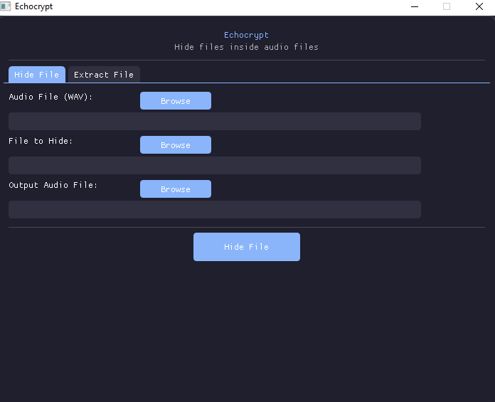

# 🔒 Echocrypt

Hide any file inside an audio file. Simple, secure, and undetectable.


## What is this?

Ever wanted to hide a secret document inside your favorite song? This tool lets you embed **any file** (images, PDFs, zip files, etc.) inside a WAV audio file. The audio still plays normally, but your file is hidden inside.

## Features

- 🎵 Hide files in WAV audio without changing how it sounds
- 📦 Works with **any file type** - documents, images, videos, whatever
- 🔄 Automatically saves the original filename and extension
- 🖥️ Clean, modern GUI - no command line needed
- 🚀 Fast and efficient LSB steganography
- 🔓 Extract hidden files with one click

## Screenshots



## How It Works

The tool uses **LSB (Least Significant Bit) steganography** - it hides your data in the least significant bits of the audio samples. This means:
- The audio quality barely changes (you won't hear the difference)
- The file size stays almost the same
- It's virtually undetectable to the human ear

## Installation

### Prerequisites

- Windows OS
- MSYS2 with MinGW-w64

### Build from Source

1. **Install MSYS2** from [msys2.org](https://www.msys2.org/)

2. **Install dependencies** (in MSYS2 MinGW 64-bit terminal):
```bash
pacman -S mingw-w64-x86_64-gcc mingw-w64-x86_64-glfw
```

3. **Clone and build**:
```bash
git clone https://github.com/yourusername/wav-steganography.git
cd wav-steganography
git clone https://github.com/ocornut/imgui.git

g++ -o stego_gui.exe main.cpp imgui/imgui.cpp imgui/imgui_demo.cpp \
    imgui/imgui_draw.cpp imgui/imgui_tables.cpp imgui/imgui_widgets.cpp \
    imgui/backends/imgui_impl_glfw.cpp imgui/backends/imgui_impl_opengl3.cpp \
    -I./imgui -I./imgui/backends -lglfw3 -lopengl32 -lgdi32 -lwinmm \
    -limm32 -lcomdlg32 -lole32 -lshell32 -mwindows
```

4. **Run it**:
```bash
./stego_gui.exe
```

## Usage

### Hiding a File

1. Open the application
2. Go to the **"Hide File"** tab
3. Click **Browse** to select your WAV audio file
4. Click **Browse** to select the file you want to hide
5. Click **Browse** to choose where to save the output WAV
6. Click **"Hide File"**

That's it! Your file is now hidden inside the audio.

### Extracting a File

1. Go to the **"Extract File"** tab
2. Click **Browse** to select the WAV file with hidden data
3. Click **Browse** to choose where to save the extracted file
4. Click **"Extract File"**

The file will be extracted with its original name and extension automatically.

## Technical Details

- **Audio Format**: 16-bit PCM WAV files only
- **Capacity**: Depends on audio length (roughly 1 byte per 8 audio samples)
- **Method**: LSB steganography on audio samples
- **Embedded Data**: File size (4 bytes) + filename length (1 byte) + filename + file data

## Limitations

- Only works with 16-bit PCM WAV files
- File to hide must be smaller than the audio capacity
- Filename must be under 255 characters

## Contributing

Pull requests are welcome! Feel free to:
- Add support for other audio formats
- Improve the encryption
- Add password protection
- Enhance the GUI

## License

MIT License - feel free to use this however you want.

## Disclaimer

This tool is for educational purposes and legitimate privacy needs. Don't use it for illegal activities. The author is not responsible for misuse.

---

Made with ❤️ and C++